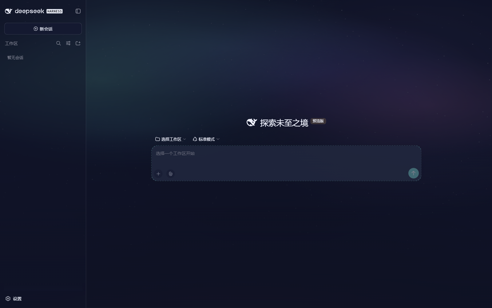
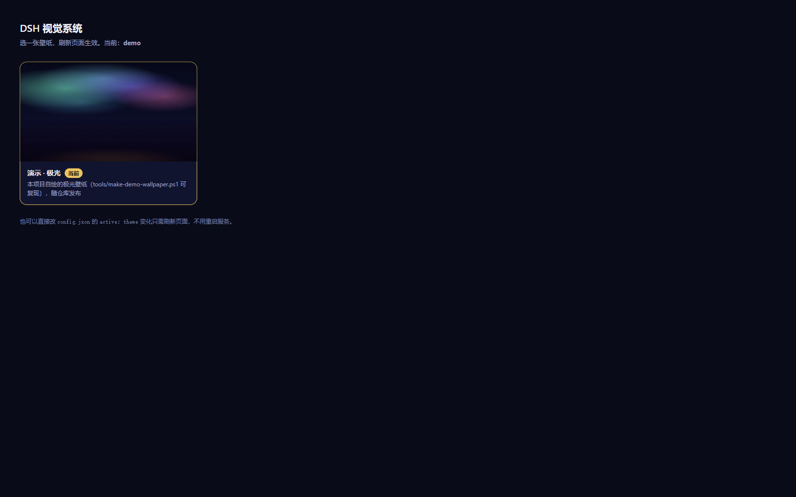

# dsh-visual-system

**壁纸驱动视觉系统** —— 给 [DeepSeek Harness](https://github.com/deepseek-ai/deepseek-harness) 的 Web GUI 与**桌面端**用。
一份 `preset.json`（十来个颜色锚点 + 一个媒体文件）就能换一整套配色和背景，支持静态图、
**视频**和 CSS 微动，并自带一个网页版切换器。

*A wallpaper-driven visual system for the DeepSeek Harness Web GUI **and the desktop app**:
one preset file swaps the entire colour system and the background, with image/video media,
subtle CSS motion, and a built-in switcher page.*





> ### ⚠️ 素材说明（先读这个）
> 本仓库**只包含代码、预设定义，以及一张自绘的演示壁纸**（`presets/demo/`）。
> `presets/*/assets/` 下的第三方素材——Steam 创意工坊场景封面、系统壁纸等——**不入库**，
> 版权不属于本项目，也不在 MIT 许可证覆盖范围内。
> 仓库里的 `executioner` / `emblem` / `desktop` / `legion` 只保留 `preset.json` 定义
> （颜色锚点与取景参数），**运行需要你自己放入素材**。
> *Third-party artwork is deliberately not shipped. Only code, preset definitions and one
> original demo wallpaper are included.*

## 支持范围

| 运行环境 | 插件加载 | 主题 + 壁纸 |
| --- | --- | --- |
| Web profile（`dsh web`） | ✅ | ✅ 已验证 |
| 桌面端（Electron，`desktop` profile） | ✅ | ✅ 已验证 |

两端都靠**同一份客户端实现**（`lib/client.js`）落地，原因见下。

### 为什么需要客户端半边（一段踩坑记录）

最早的实现只做宿主侧：用 `webserver/index-inject` 往宿主渲染的 `index.html` 里塞
`<style>` 和 body 片段。这在 web 端没问题，但**桌面端完全不生效**——桌面端窗口加载的是
打包页面（`dsh-app://app/`），它只消费注入表里的「全局变量」那类条目
（桌面端自己用它注入 `__DSH_CONNECTION_RECOVERY__`、启动注入、快捷键配置），
不吃 `style` / `html` 行。当时用一个「配色改成品红」的探针预设做过对照实验确认：
窗口重载后毫无变化。

修法是把「应用主题」搬到**客户端插件**里（渲染进程直接操作 DOM），宿主只负责算和发：

```text
宿主半边 index.js         客户端半边 lib/client.js
├─ 生成完整 --dsw-* CSS   ├─ GET /dsh-visual/state（拿 CSS + 素材地址）
├─ /dsh-visual/asset/**   ├─ 往 <head> 贴 <style>
├─ /dsh-visual/state      ├─ 往 <body> 首个位置插 #dsh-visual-media
└─ /dsh-visual/ 切换页     └─ 每 4 秒轮询一次，切预设即时生效
```

桌面端的验证方式同样是探针预设：把配色改成品红后**不重启、不重载**，界面在几秒内变红
（客户端轮询拿到新状态），撤掉探针又恢复。web 与桌面端的渲染进程是同一套前端，所以两端行为一致。

顺带一提：桌面端支持对 `cordis.patch.yml` **热插拔**（存盘即生效、删掉即卸载），
配合上面的轮询，改预设 / 改代码基本不用重启。

## 特性

- **一份 preset.json = 一套主题**：十来个颜色锚点，由 `lib/palette.mjs` 展开成 DSH 设计系统
  完整的 `--dsw-*` token 集（色阶、语义别名、表面 token、状态色、滚动条），不用手写一百多个变量
- 支持静态图、视频（`mp4` / `webm`）、CSS 微动（`sway` 呼吸式、`drift` 缓慢推移）
- 尊重 `prefers-reduced-motion`
- 自带切换页面 `/dsh-visual/`，点图即切
- 素材路由支持 **Range**（视频可拖动进度）与 **ETag**（304 复用）
- 素材路径做了目录穿越防护；预设目录外的文件只能通过 `preset.json` 里写死的 `assetPath` 引用
- 视觉失败绝不影响页面：宿主注入与客户端都各自吞掉异常，只记一条警告

## 安装

插件挂在某个 profile 的 patch 层里。**改完存盘即生效**（loader 热应用 patch），不需要重启服务。

1. 把本仓库放到任意目录，例如 `<你放插件的地方>\dsh-visual-system`。
2. 编辑目标 profile 的 patch 文件：

   ```yaml
   - insert:
       - id: visual-system
         name: 'file:///C:/你的路径/dsh-visual-system/index.js?v=1'
   ```

   - Web GUI：`$DSH_HOME/profiles/web/cordis.patch.yml`
   - **桌面端**：`$DSH_HOME/profiles/desktop/cordis.patch.yml`
     （桌面端会自己重写这个文件里的 `- id:` 条目，但不会动你的 `- insert:`）

   > Windows 路径写成 `file:///C:/...`（正斜杠）。`?v=N` 是模块缓存破坏参数：
   > 改 `index.js` / `lib/*.mjs` 之后把它递增。
   > 客户端半边（`lib/client.js`）由宿主按 `package.json` 的 `dsh.client` 声明发现，
   > 改完刷新一次页面即可。

3. 刷新页面（或重载窗口）即生效。

卸载：删掉那段 `- insert:`，刷新页面就回到原生配色（插件目录留着不影响任何东西）。

## 仓库里的预设

| id | 名称 | 媒体 | 素材是否随仓库 |
| --- | --- | --- | --- |
| `demo` | 演示 · 极光 | `assets/aurora.png` 1920×1080，缓慢推移 | ✅ 本项目自绘，可直接用 |
| `executioner` | 处刑者 · ゆらぎ | `assets/cover.png` 3840×2160 + 呼吸式微动 | ❌ 需自备 |
| `emblem` | 国徽 | `assets/emblem.mp4` 3840×2400 30s 视频（可配 `poster`） | ❌ 需自备 |
| `desktop` | 唤起工农千百万 | 视频，通过 `assetPath` 直接引用本机已有文件 | ❌ 需自备 |
| `legion` | LEGION 蓝龙 | `assets/wallpaper.jpg` 3840×2400 + 缓慢推移 | ❌ 需自备 |

把素材放进对应的 `presets/<id>/assets/` 目录即可；`assetPath` 那种写法用于
"素材已经在别处、不想复制一份"的情况（只接受 `preset.json` 里写死的文件名，
URL 里传的路径不会碰到磁盘）。

## 切换

浏览器打开 **`http://<你的 DSH 地址>/dsh-visual/`**，点图即切。（桌面端也可以在
`http://127.0.0.1:<桌面端端口>/dsh-visual/` 打开同一个页面。）等价于直接改 `config.json`：

```json
{ "active": "demo" }
```

因为客户端每 4 秒轮询一次状态，**改完不刷新页面也会生效**。

其它接口：

```text
GET  /dsh-visual/config                  # 当前预设 + 预设清单
POST /dsh-visual/config  {"active":"…"}  # 切换
GET  /dsh-visual/state                   # 客户端半边用：CSS + 素材地址
GET  /dsh-visual/asset/<id>/<path>       # 预设素材（支持 Range，视频可拖动）
```

## 加一个预设

1. 建 `presets/<id>/`，放 `preset.json` 和媒体文件。
2. 锚点写进 `dark` / `light` 两套。最少只要这几个：

```jsonc
{
  "id": "mywall",
  "title": "显示名",
  "note": "一句话来源说明",
  "kind": "image",              // 或 "video"
  "asset": "assets/cover.png",
  "assetPath": "D:\\...\\x.mp4", // 可选：素材在别处（只允许 preset 里写死的名字）
  "focus": "center 40%",         // object-position
  "motion": { "kind": "drift", "duration": 70, "shift": 1.2 },  // 或 "sway"
  "dark":  { "base": "#070a20", "surface": "#151b3b", "ink": "#eef1fb",
             "accent": "#f2c14e", "accent2": "#5ad2e6", "business": "#f2c14e",
             "veil": 0.5,
             "scrim": { "base": "rgba(5,7,20,0.66)", "wash": ["radial-gradient(...)"], "vignette": 0.46 } },
  "light": { "base": "#ffffff", "surface": "#f8f9fe", "ink": "#090b1f",
             "accent": "#c98a12", "accent2": "#0f6d88", "veil": 0.97 }
}
```

`veil` 控制表面透明度（越大越不透明），`scrim` 是压在图上面的那层纱。

## 图层顺序（这是关键）

`body` 的背景色会被传播成画布底色，所以**纱（scrim）不能放在 body 上**，否则会跑到壁纸下面。
现在的顺序是：

```text
body 背景色(画布) → #dsh-visual-media 媒体 → ::after 纱/晕影 → 应用表面(半透明 token) → 内容
```

`#dsh-visual-media` 位于 `z-index:-1`，`::after` 承载 `scrim`，读长文本时靠 `vignette`
在阅读栏下压出一片墨色。浅色模式默认不显示壁纸（用纸面配色），预设里加
`"light": { "showWallpaper": true }` 可以打开。

## 工具

### 生成演示壁纸

仓库自带的那张极光是**代码画出来的**，可复现、无版权问题：

```powershell
pwsh -NoProfile -File tools/make-demo-wallpaper.ps1
pwsh -NoProfile -File tools/make-demo-wallpaper.ps1 -Out out.png -Width 2560 -Height 1440
```

做法是把光斑先画在 1/8 分辨率的小图上，再用高质量双三次插值放大回原尺寸，
得到柔和的光带而不是能看出边界的椭圆；星星和底部压暗仍画在全分辨率上。

### Wallpaper Engine 素材提取

`tools/we-pkg.mjs` / `tools/we-tex.mjs` 用于从你自己机器上的 Wallpaper Engine 场景里
取出原始美术（`presets/executioner` 的 3840×2160 封面就是这么来的）：

```powershell
node tools/we-pkg.mjs list "…\431960\3223543799\scene.pkg"
node tools/we-pkg.mjs extract "…\scene.pkg" "materials/封面.tex" cover.tex
node tools/we-tex.mjs probe  cover.tex
node tools/we-tex.mjs carve  cover.tex cover.png
```

`we-tex.mjs` 另外带一套 DXT1/3/5 与 RGBA 解码器，供老版本（裸 mip 链）的 `.tex` 用。
这两个脚本与 Wallpaper Engine 官方无关，只是读取你自己已有的文件。

## 目录结构

```text
index.js                     宿主半边：生成 CSS、提供素材/状态/切换器路由
lib/client.js                客户端半边：把 CSS 与壁纸贴进页面（web + 桌面端通用）
lib/palette.mjs              颜色锚点 → 完整 --dsw-* token 集
presets/<id>/                一个目录一个预设（preset.json + assets/）
preview/                     README 用的截图（均为自绘 demo 预设，版权干净）
tools/make-demo-wallpaper.ps1  生成演示壁纸
tools/we-pkg.mjs, we-tex.mjs   Wallpaper Engine .pkg / .tex 提取工具
config.json                  当前选中的预设（每台机器不同，已 gitignore）
```

## 客户端 bundle 的格式

`lib/client.js` 是**手写的**，没有构建步骤。它遵循官方 tsdown 预设产出的闭包工厂格式：

```js
window.__ModuleLoader__.load({
  id: 'dsh-visual-system',
  factory: function (require) { /* ... */ return { name, apply }; },
});
```

因为本插件只用 DOM 和 `fetch`，不依赖任何平台模块，所以 `dsh.client.inject` 是空的，
也就不需要打包器。

## 环境要求

- 一个能起 Web GUI 的 DeepSeek Harness profile，或桌面端（Electron）。
- 宿主半边跑在 DSH 进程里；客户端半边跑在页面里（Node 版本取决于 DSH 本体）。

## License

MIT，见 [LICENSE](LICENSE)。**只覆盖代码与预设定义**，不覆盖任何第三方素材。
